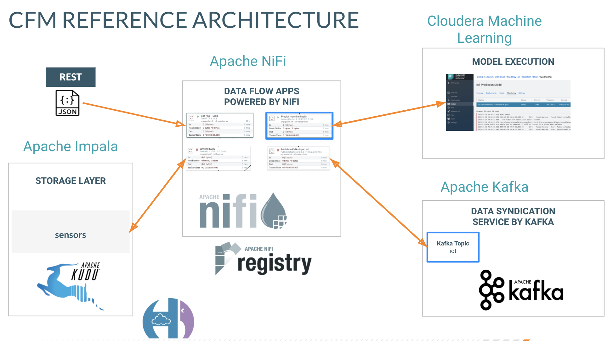

= Cloudera Flow Management (CFM) Workshop with Apache NiFi

== Introduction

In this virtual hands-on workshop, you will build a real workflow for an **IoT Predictive Maintenance** use case.    You will get hands-on experience in using CFM (Cloudera Flow Management Powered by Apache NiFi) for production use cases.

=== Before you start

* Everything is Case-Sensitive. 
* Check all your connections and spellings

=== Pre-requisites

* Computer/Laptop with a supported OS (Windows 7 not supported).
* A modern browser like Google Chrome or Firefox (IE not supported).
* Turn Off Your Corporate VPN
* Use a personal laptop if possible
* You will be connecting to an Amazon IP or Domain with many web ports hosted on AWS
* Get your IP with http://icanhazip.com/

=== Connecting to your cluster

You instructor will give access to a registration link where you can request a cluster. You should have 2 addresses for you one-node cluster: the public DNS name and the public IP address. With those addresses you can test the following connectivity to your cluster:

. Ensure you can connect to the following service using your browser:
+
[%autowidth,options="header"]
|===
|Service|URL|Credentials
|Cloudera Manager|http://<public_dns>:7180/|`admin/admin`
|NiFi|http://<public_dns>:8080/nifi/|
|NiFi Registry|http://<public_dns>:18080/nifi-registry/|
|Schema Registry|http://<public_dns>:7788/|
|Hue|http://<public_dns>:8888/|`admin/admin`
|===
. Login into *Cloudera Manager* and familiarize yourself with the services installed
. Login into *Hue*. As you are the first user to login into Hue, you are granted admin privileges. At this point, you won't need to do anything on Hue, but by logging in, CDH has created your HDFS user and folder, which you will need for the next lab.  When you log into Hue, do so as admin/admin.

== Labs

= Flow Management

In this workshop you'll implement a data pipeline, using MiNiFi and NiFi to ingest data from an IoT device into Kafka and then consume data from Kafka and write it to Kudu tables.

== Labs summary

* *Lab 1* - On the NiFi cluster, prepare the data and send it to the **Kafka** cluster.
* *Lab 2* - Use NiFi to process each record, calling the **Model endpoint** and save results to **Kudu**.

[[lab_1, Lab 1]]
== Lab 1 - Configuring the NiFi flow and pushing data to Kafka

In this lab you will run a simple Python script that simulates IoT sensor data from some hypothetical machines, and send the data to a MQTT broker (link:https://mosquitto.org/[mosquitto]). The MQTT broker plays the role of a gateway that is connected to many and different type of sensors through the "mqtt" protocol. Your cluster comes with an embedded MQTT broker that the simulation script publishes to. For convenience, we will use NiFi to run the script rather than Shell commands.

. Go to Apache NiFi and add a Processor (ExecuteProcess) to the canvas.
+
image::images/simulate1.png[width=800]

. Right-click the processor, select *Configure* (or, alternatively, just double-click the processor). On the *PROPERTIES* tab, set the properties shown below to run our Python simulate script.
+
[source]
----
Command:           python3
Command Arguments: /opt/demo/simulate.py
----
+
image::images/simulate2.png[width=500]

. In the *SCHEDULING* tab, set to *Run Schedule: 1 sec*
+
Alternatively, you could set that to other time intervals: 1 sec, 30 sec, 1 min, etc...
+
image::images/runSimulator1or30.png[width=500]

. In the *SETTINGS* tab, check the "*success*" relationship in the *AUTOMATICALLY TERMINATED RELATIONSHIPS* section. Click *Apply*.
+
image::images/nifiTerminateRelationships.png[width=600]

. You can then right-click to *Start* this simulator runner.
+
image::images/nifiDemoStart.png[width=400]

. Right-click and select *Stop* after a few seconds and look at the *provenance*. You'll see that it has run a number of times and produced results.
+
image::images/NiFiViewDataProvenance.png[width=400]
+
image::images/NiFiDataProvenance.png[width=800]

In this lab, you will create a NiFi flow to receive the data from all gateways and push it to **Kafka**.

=== Creating a Process Group

Before we start building our flow, let's create a Process Group to help organizing the flows in the NiFi canvas and also to enable flow version control.

. Open the NiFi Web UI, create a new Process Group and name it something like *Process Sensor Data*.
+
image::images/create_pgroup.png[width=800]

. We want to be able to version control the flows we will add to the Process Group. In order to do that, we first need to connect NiFi to the *NiFi Registry*. On the NiFi global menu, click on "Controller Settings", navigate to the "Registry Clients" tab and add a Registry client with the following URL:
+
----
Name: NiFi Registry
URL:  http://edge2ai-1.dim.local:18080
----
+
image::images/global_controller_settings.png[width=800]
+
image::images/add_registry_client.png[width=800]

. On the *NiFi Registry* Web UI, add another bucket for storing the Sensor flow we're about to build'. Call it `SensorFlows`:
+
image::images/sensor_flows_bucket.png[width=800]

. Back on the *NiFi* Web UI, to enable version control for the Process Group, right-click on it and select *Version > Start version control* and enter the details below. Once you complete, a image:images/version_control_tick.png[width=20] will appear on the Process Group, indicating that version control is now enabled for it.
+
[source]
----
Registry:  NiFi Registry
Bucket:    SensorFlows
Flow Name: SensorProcessGroup
----

. Let's also enable processors in this Process Group to use schemas stored in Schema Registry. Right-click on the Process Group, select *Configure* and navigate to the *Controller Services* tab. Click the *`+`* icon and add a *HortonworksSchemaRegistry* service. After the service is added, click on the service's _cog_ icon (image:images/cog_icon.png[width=20]), go to the *Properties* tab and configure it with the following *Schema Registry URL* and click *Apply*.
+
[source]
----
URL: http://edge2ai-1.dim.local:7788/api/v1
----
+
image::images/added_hwx_sr_service.png[width=800]

. Click on the _lightning bolt_ icon (image:images/enable_icon.png[width=20]) to *enable* the *HortonworksSchemaRegistry* Controller Service.

. Still on the *Controller Services* screen, let's add two additional services to handle the reading and writing of JSON records. Click on the image:images/plus_button.png[width=25] button and add the following two services:
** *`JsonTreeReader`*, with the following properties:
+
[source]
----
Schema Access Strategy: Use 'Schema Name' Property
Schema Registry:        HortonworksSchemaRegistry
Schema Name:            ${schema.name} -> already set by default!
----

** *`JsonRecordSetWriter`*, with the following properties:
+
[source]
----
Schema Write Strategy:  HWX Schema Reference Attributes
Schema Access Strategy: Use 'Schema Name' Property
Schema Registry:        HortonworksSchemaRegistry
----

. Enable the *JsonTreeReader* and the *JsonRecordSetWriter* Controller Services you just created, by clicking on their respective _lightning bolt_ icons (image:images/enable_icon.png[width=20]).
+
image::images/controller_services.png[width=800]

=== Creating the flow

. Double-click on the newly created process group to expand it.

. Inside the process group, add a new _Input Port_ and name it "Sensor Data"

. We need to tell NiFi which schema should be used to read and write the Sensor data. For this we'll use an _UpdateAttribute_ processor to add an attribute to the FlowFile indicating the schema name.
+
Add an _UpdateAttribute_ processor by dragging the processor icon to the canvas:
+
image::images/add_updateattribute.png[width=800]

. Double-click the _UpdateAttribute_ processor and configure it as follows:
.. In the _SETTINGS_ tab:
+
[source]
----
Name: Set Schema Name
----
.. In the _PROPERTIES_ tab:
** Click on the image:images/plus_button.png[width=25] button and add the following property:
+
[source]
----
Property Name:  schema.name
Property Value: SensorReading
----
.. Click *Apply*

. Connect the *Sensor Data* input port to the *Set Schema Name* processor.

. Add a _PublishKafkaRecord_2.0_ processor and configure it as follows:
+
*SETTINGS* tab:
+
[source]
----
Name:                                  Publish to Kafka topic: iot
----
+
*PROPERTIES* tab:
+
[source]
----
Kafka Brokers:                         edge2ai-1.dim.local:9092
Topic Name:                            iot
Record Reader:                         JsonTreeReader
Record Writer:                         JsonRecordSetWriter
Use Transactions:                      false
Attributes to Send as Headers (Regex): schema.*
----
+
NOTE: Make sure you use the PublishKafkaRecord_2.0 processor and *not* the PublishKafka_2.0 one

. While still in the _PROPERTIES_ tab of the _PublishKafkaRecord_2.0_ processor, click on the image:images/plus_button.png[width=25] button and add the following property:
+
[source]
----
Property Name:  client.id
Property Value: nifi-sensor-data
----
+
Later, this will help us clearly identify who is producing data into the Kafka topic.

. Connect the *Set Schema Name* processor to the *Publish to Kafka topic: iot* processor.

. Add a new _Funnel_ to the canvas and connect the PublishKafkaRecord processor to it. When the "Create connection" dialog appears, select "*failure*" and click *Add*.
+
image::images/add_kafka_failure_connection.png[width=600]

. Double-click on the *Publish to Kafka topic: iot* processor, go to the *SETTINGS* tab, check the "*success*" relationship in the *AUTOMATICALLY TERMINATED RELATIONSHIPS* section. Click *Apply*.
+
image::images/terminate_publishkafka_relationship.png[width=600]

. Start the input port and the two processors. Your canvas should now look like the one below:
+
image::images/publishKafka_flow.png[width=800]

. The only thing that remains to be configured now is to finally connect the "*from Gateway*" Input Port to the flow in the "*Processor Sensor Data*" group. To do that, first go back to the root canvas by clicking on the *NiFi Flow* link on the status bar.
+
image::images/breadcrumbs.png[width=400]

. Connect the Input Port to the *Process Sensor Data* Process Group by dragging the destination of the current connection from the funnel to the Process Group. When prompted, ensure the "To input" fields is set to the *Sensor data* Input Port.
+
image::images/connect_input.png[width=800]
+
image::images/to_input.png[width=800]

. Refresh the screen (`Ctrl+R` on Linux/Windows; `Cmd+R` on Mac) and you should see that the records that were queued on the "*from Gateway*" Input Port disappeared. They flowed into the *Process Sensor Data* flow. If you expand the Process Group you should see that those records were processed by the _PublishKafkaRecord_ processor and there should be no records queued on the "failure" output queue.
+
image::images/kafka_success.png[width=800]
+
At this point, the messages are already in the Kafka topic. You can add more processors as needed to process, split, duplicate or re-route your FlowFiles to all other destinations and processors.

. To complete this Lab, let's commit and version the work we've just done. Go back to the NiFi root canvas, clicking on the "Nifi Flow" breadcrumb. Right-click on the *Process Sensor Data* Process Group and select *Version > Commit local changes*. Enter a descriptive comment and save.

[[lab_2, Lab 2]]
== Lab 2 - Use NiFi to call the CDSW model endpoint and save to Kudu

In this lab, you will use NiFi to consume the Kafka messages containing the IoT data we ingested in the previous lab, call a CDSW model API endpoint to predict whether the machine where the readings came from is likely to break or not.

In preparation for the workshop we trained and deployed a Machine Learning model on the Cloudera Data Science Workbench (CDSW) running on your cluster. The model API can take a feature vector with the reading for the 12 temperature readings provided by the sensor and predict, based on that vector, if the machine is likely to break or not.

=== Add new Controller Services

When the sensor data was sent to Kafka using the _PublishKafkaRecord_ processor, we chose to attach the schema information in the header of Kafka messages. Now, instead of hard-coding which schema we should use to read the message, we can leverage that metadata to dynamically load the correct schema for each message.

To do this, though, we need to configure a different _JsonTreeReader_ that will use the schema properties in the header, instead of the `${schema.name}` attribute, as we did before.

We'll also add a new _RestLookupService_ controller service to perform the calls to the CDSW model API endpoint.

. If you're not in the *Process Sensor Data* process group, double-click on it to expand it. On the *Operate* panel (left-hand side), click on the _cog_ icon (image:images/cog_icon.png[width=25]) to access the *Process Sensor Data* process group's configuration page.
+
image::images/operate_panel_cog.png[width=300]

. Click on the _plus_ button (image:images/plus_button.png[width=25]), add a new *JsonTreeReader*, configure it as shown below and click *Apply* when you're done:
+
On the *SETTINGS* tab:
+
[source]
----
Name: JsonTreeReader - With schema identifier
----
+
On the *PROPERTIES* tab:
+
[source]
----
Schema Access Strategy: HWX Schema Reference Attributes
Schema Registry:        HortonworksSchemaRegistry
----

. Click on the _lightning bolt_ icon (image:images/enable_icon.png[width=20]) to *enable* the *JsonTreeReader - With schema identifier* controller service.

. Click again on the _plus_ button (image:images/plus_button.png[width=25]), add a *RestLookupService* controller service, configure it as shown below and click *Apply* when you're done:
+
On the *PROPERTIES* tab:
+
[source]
----
URL:           http://cdsw.<YOUR_CLUSTER_PUBLIC_IP>.nip.io/api/altus-ds-1/models/call-model
Record Reader: JsonTreeReader
Record Path:   /response
----
+
NOTE: `<YOUR_CLUSTER_PUBLIC_IP>` above must be replaced with your cluster's public IP, *not* DNS name. The final URL should look something like this: `\http://cdsw.12.34.56.78.nip.io/api/altus-ds-1/models/call-model`

. Click on the _lightning bolt_ icon (image:images/enable_icon.png[width=20]) to *enable* the *RestLookupService* controller service.
+
image::images/additional_controller_services.png[width=800]

. Close the *Process Sensor Data Configuration* page.

=== Create the flow

We'll now create the flow to read the sensor data from Kafka, execute a model prediction for each of them and write the results to Kudu. At the end of this section you flow should look like the one below:

image::images/from_kafka_to_kudu_flow.png[width=800]

==== ConsumeKafkaRecord_2_0 processor

. We'll add a new flow to the same canvas we were using before (inside the *Process Sensor Data* Process Group). Click on an empty area of the canvas and drag it to the side to give you more space to add new processors.

. Add a *ConsumeKafkaRecord_2_0* processor to the canvas and configure it as shown below:
+
*SETTINGS* tab:
+
[source]
----
Name: Consume Kafka iot messages
----
+
*PROPERTIES* tab:
+
[source]
----
Kafka Brokers:                        edge2ai-1.dim.local:9092
Topic Name(s):                        iot
Topic Name Format:                    names
Record Reader:                        JsonTreeReader - With schema identifier
Record Writer:                        JsonRecordSetWriter
Honor Transactions:                   false
Group ID:                             iot-sensor-consumer
Offset Reset:                         latest
Headers to Add as Attributes (Regex): schema.*
----

. Add a new _Funnel_ to the canvas and connect the *Consume Kafka iot messages* to it. When prompted, check the *parse.failure* relationship for this connection:
+
image:images/parse_failure_relationship.png[width=500]

==== LookupRecord processor

. Add a *LookupRecord* processor to the canvas and configure it as shown below:
+
*SETTINGS* tab:
+
[source]
----
Name: Predict machine health
----
+
*PROPERTIES* tab:
+
[source]
----
Record Reader:          JsonTreeReader - With schema identifier
Record Writer:          JsonRecordSetWriter
Lookup Service:         RestLookupService
Result RecordPath:      /response
Routing Strategy:       Route to 'success'
Record Result Contents: Insert Entire Record
----

. Add 3 more user-defined properties by clicking on the _plus_ button (image:images/plus_button.png[width=25]) for each of them:
+
[source]
----
mime.type:      toString('application/json', 'UTF-8')
request.body:   concat('{"accessKey":"', '${cdsw.access.key}', '","request":{"feature":"', /sensor_0, ', ', /sensor_1, ', ', /sensor_2, ', ', /sensor_3, ', ', /sensor_4, ', ', /sensor_5, ', ', /sensor_6, ', ', /sensor_7, ', ', /sensor_8, ', ', /sensor_9, ', ', /sensor_10, ', ', /sensor_11, '"}}')
request.method: toString('post', 'UTF-8')
----

. Click *Apply* to save the changes to the *Predict machine health* processor.

. Connect the *Consume Kafka iot messages* processor to the *Predict machine health* one. When prompted, check the *success* relationship for this connection.

. Connect the *Predict machine health* to the same _Funnel_ you had created above. When prompted, check the *failure* relationship for this connection.

==== UpdateRecord processor

. Add a *UpdateRecord* processor to the canvas and configure it as shown below:
+
*SETTINGS* tab:
+
[source]
----
Name: Update health flag
----
+
*PROPERTIES* tab:
+
[source]
----
Record Reader:              JsonTreeReader - With schema identifier
Record Writer:              JsonRecordSetWriter
Replacement Value Strategy: Record Path Value
----

. Add one more user-defined propertie by clicking on the _plus_ button (image:images/plus_button.png[width=25]):
+
[source]
----
/is_healthy: /response/result
----

. Connect the *Predict machine health* processor to the *Update health flag* one. When prompted, check the *success* relationship for this connection.

. Connect the *Update health flag* to the same _Funnel_ you had created above. When prompted, check the *failure* relationship for this connection.

==== PutKudu processor

. Add a *PutKudu* processor to the canvas and configure it as shown below:
+
*SETTINGS* tab:
+
[source]
----
Name: Write to Kudu
----
+
*PROPERTIES* tab:
+
[source]
----
Kudu Masters:     edge2ai-1.dim.local:7051
Table Name:       impala::default.sensors
Record Reader:    JsonTreeReader - With schema identifier
----

. Connect the *Update health flag* processor to the *Write to Kudu* one. When prompted, check the *success* relationship for this connection.

. Connect the *Write to Kudu* to the same _Funnel_ you had created above. When prompted, check the *failure* relationship for this connection.

. Double-click on the *Write to Kudu* processor, go to the *SETTINGS* tab, check the "*success*" relationship in the *AUTOMATICALLY TERMINATED RELATIONSHIPS* section. Click *Apply*.

==== CDSW Access Key

When we added the *Predict machine health* above, you may have noticed that one of the properties (`request.body`) makes a reference to a variable called `cdsw.access.key`. This is an application key required to authenticate with the CDSW Model API when requesting predictions. So, we need to provide the key to the _LookupRecord_ processor by setting a variable with its value.

. To get the Access Key, go to the CDSW Web UI and click on *Models > Iot Prediction Model > Settings*. Copy the Access Key.
+
image::images/model_access_key.png[width=800]

. Go back to the NiFi Web UI, right-click on an empty area of the *Process Sensor Data* canvas, and click on *Variables*.

. Click on the _plus_ button (image:images/plus_button.png[width=25]) and add the following variable:
+
[source]
----
Variable Name:  cdsw.access.key
Variable Value: <key copied from CDSW>
----
+
image::images/access_key_variable.png[width=800]

. Click *Apply*

==== Create the Kudu table

NOTE: If you already created this table in a previous workshop, please skip the table creation here.

. Go to the Hue Web UI and login. The first user to login to a Hue installation is automatically created and granted admin privileges in Hue.

. The Hue UI should open with the Impala Query Editor by default. If it doesn't, you can always find it by clicking on *Query button > Editor -> Impala*:
+
image::images/impala_editor.png[width=800]

. First, create the Kudu table. Login into Hue, and in the Impala Query, run this statement:
+
[source,sql]
----
CREATE TABLE sensors
(
 sensor_id INT,
 sensor_ts TIMESTAMP,
 sensor_0 DOUBLE,
 sensor_1 DOUBLE,
 sensor_2 DOUBLE,
 sensor_3 DOUBLE,
 sensor_4 DOUBLE,
 sensor_5 DOUBLE,
 sensor_6 DOUBLE,
 sensor_7 DOUBLE,
 sensor_8 DOUBLE,
 sensor_9 DOUBLE,
 sensor_10 DOUBLE,
 sensor_11 DOUBLE,
 is_healthy INT,
 PRIMARY KEY (sensor_ID, sensor_ts)
)
PARTITION BY HASH PARTITIONS 16
STORED AS KUDU
TBLPROPERTIES ('kudu.num_tablet_replicas' = '1');
----
+
image::images/create_table.png[width=800]

==== Running the flow

We're ready now to run and test our flow. Follow the steps below:

. Start all the processors in your flow.

. Refresh your NiFi page and you should see messages passing through your flow. The failure queues should have no records queued up.
+
image::images/kudu_success.png[width=800]

. Login into Hue and run the following queries in the Impala Query Editor:
+
[source,sql]
----
SELECT count(*)
FROM sensors;
----
+
[source,sql]
----
SELECT *
FROM sensors
ORDER by sensor_ts DESC
LIMIT 100;
----

. Run the queries a few times \and verify that the number of sensor readings are increasing as the data is ingested into the Kudu table. This allows you to build real-time reports for fast action.
+
image::images/table_select.png[width=800]

[[lab_3, Lab 3]]
== Bonus Lab 3 - Use NiFi to call REST API, transform, route and store the data

* link:lab3.adoc[Another NiFi Example Flow (REST->Kafka, REST->HDFS, REST-> Kudu/Impala]

== Resources
  
* link:https://medium.freecodecamp.org/building-an-iiot-system-using-apache-nifi-mqtt-and-raspberry-pi-ce1d6ed565bc[Original blog by Abdelkrim Hadjidj]

* This workshop is part of the CDF Workshop Series by Andre, Dan, Abdelkrim and Vasillis 
** https://github.com/asdaraujo/edge2ai-workshop

* This workshop is based on the following work by Fabio Ghirardello:
** https://github.com/fabiog1901/IoT-predictive-maintenance
** https://github.com/fabiog1901/OneNodeCDHCluster

* link:https://www.cloudera.com/documentation.html[Cloudera Documentation]

[[troubleshooting, Troubleshooting]]
== Troubleshooting

==== General

* *Everything is Case-Sensitive*.
* Check all your connections and spellings
