[[lab_3, Lab 3]]
== Bonus Lab 3 - Use NiFi to call REST API, transform, route and store the data

Pick any REST API of your choice, but I have walked through this one to grab a number of weather stations reports.

image::images/workshopoverview.png[width=800]

We are going to build a GenerateFlowFile to feed our REST calls.

image::images/generateflowfile.png[width=800]

[source,json]
----
[
{"url":"http://weather.gov/xml/current_obs/CWAV.xml"},
{"url":"http://weather.gov/xml/current_obs/KTTN.xml"},
{"url":"http://weather.gov/xml/current_obs/KEWR.xml"},
{"url":"http://weather.gov/xml/current_obs/KEWR.xml"},
{"url":"http://weather.gov/xml/current_obs/CWDK.xml"},
{"url":"http://weather.gov/xml/current_obs/CWDZ.xml"},
{"url":"http://weather.gov/xml/current_obs/CWFJ.xml"},
{"url":"http://weather.gov/xml/current_obs/PAEC.xml"},
{"url":"http://weather.gov/xml/current_obs/PAYA.xml"},
{"url":"http://weather.gov/xml/current_obs/PARY.xml"},
{"url":"http://weather.gov/xml/current_obs/K1R7.xml"},
{"url":"http://weather.gov/xml/current_obs/KFST.xml"},
{"url":"http://weather.gov/xml/current_obs/KSSF.xml"},
{"url":"http://weather.gov/xml/current_obs/KTFP.xml"},
{"url":"http://weather.gov/xml/current_obs/CYXY.xml"},
{"url":"http://weather.gov/xml/current_obs/KJFK.xml"},
{"url":"http://weather.gov/xml/current_obs/KISP.xml"},
{"url":"http://weather.gov/xml/current_obs/KLGA.xml"},
{"url":"http://weather.gov/xml/current_obs/KNYC.xml"},
{"url":"http://weather.gov/xml/current_obs/KJRB.xml"}
]
----

So we are using ${url} which will be one of these.   Feel free to pick your favorite airports or locations near you.   https://w1.weather.gov/xml/current_obs/index.xml

If you wish to choose your own data adventure, you can pick one of these others.   You will have to build your own table if you wish to store it.  They return CSV, JSON or XML, since we have record processors we don't care.  Just know which you pick.

* https://min-api.cryptocompare.com/data/price?fsym=ETH&tsyms=BTC,USD,EUR
* https://data.cdc.gov/api/views/cjae-szjv/rows.json?accessType=DOWNLOAD
* https://api.weather.gov/stations/KTTN/observations/current                                                                  * https://www1.nyc.gov/assets/tlc/downloads/csv/data_reports_monthly_indicators.csv
* https://docs.coincap.io/?version=latest

Then we will use SplitJSON to split the JSON records into single rows.

image::images/splitjson.png[width=800]

Then use EvaluateJSONPath to extract the URL.

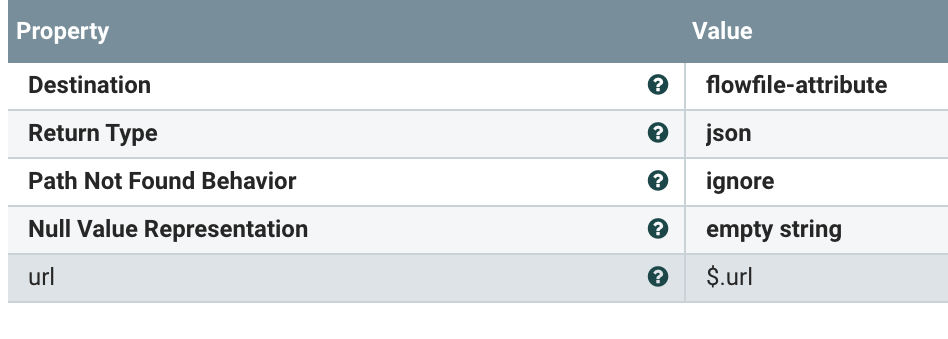

Now we are going to call those REST URLs with InvokeHTTP.

You will need to create a Standard SSL controller.

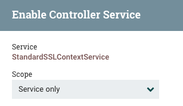

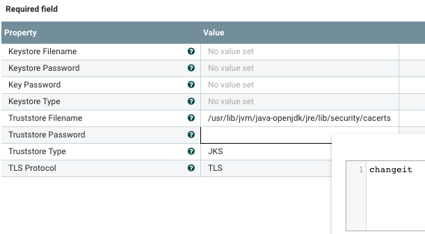

image::images/sslcontext.png[width=800]

Truststore filename: /usr/lib/jvm/java-openjdk/jre/lib/security/cacerts
Truststore password: changeit
Truststore type:  JKS
TLS Protocol:     TLS

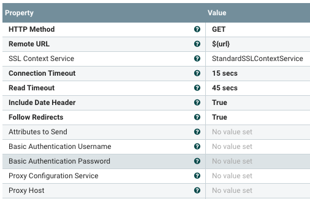

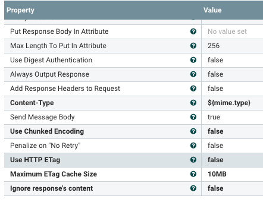

Then we are going to run a query to convert these and route based on our queries.

Example query on the current NOAA weather observations to look for temperature in fareneheit below 60 degrees.   You can make a query with any of the fields in the where cause.  Give it a try!

image::images/queryRecord.png[width=800]

You will need to set the Record Writer and Record Reader:

Record Reader:   XML
Record Writer:   JSON

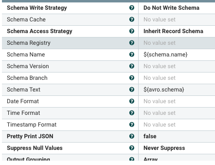

[source,sql]
----
SELECT * FROM FLOWFILE
WHERE temp_f <= 60
----

[source,sql]
----
SELECT * FROM FLOWFILE
----

Now we are splitting into three concurrent paths.   This shows the power of Apache NiFi.   We will write to Kudu, HDFS and Kafka.

For the results of our cold path (temp_f <=60), we will write to a Kudu table.

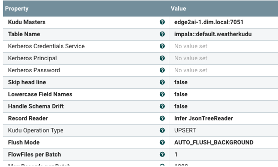

Kudu Masters: edge2ai-1.dim.local:7051
Table Name:  impala::default.weatherkudu
Record Reader:   Infer Json Tree Reader
Kudu Operation Type: UPSERT

Before you run this, go to Hue and build the table.

image::images/huechooseimpala.png[width=800]

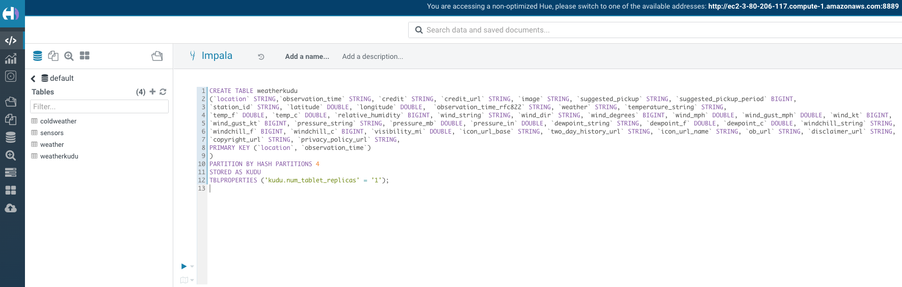

[source,sql]
----
CREATE TABLE weatherkudu
(`location` STRING,`observation_time` STRING, `credit` STRING, `credit_url` STRING, `image` STRING, `suggested_pickup` STRING, `suggested_pickup_period` BIGINT,
`station_id` STRING, `latitude` DOUBLE, `longitude` DOUBLE,  `observation_time_rfc822` STRING, `weather` STRING, `temperature_string` STRING, 
`temp_f` DOUBLE, `temp_c` DOUBLE, `relative_humidity` BIGINT, `wind_string` STRING, `wind_dir` STRING, `wind_degrees` BIGINT, `wind_mph` DOUBLE, `wind_gust_mph` DOUBLE, `wind_kt` BIGINT,
`wind_gust_kt` BIGINT, `pressure_string` STRING, `pressure_mb` DOUBLE, `pressure_in` DOUBLE, `dewpoint_string` STRING, `dewpoint_f` DOUBLE, `dewpoint_c` DOUBLE, `windchill_string` STRING, 
`windchill_f` BIGINT, `windchill_c` BIGINT, `visibility_mi` DOUBLE, `icon_url_base` STRING, `two_day_history_url` STRING, `icon_url_name` STRING, `ob_url` STRING, `disclaimer_url` STRING, 
`copyright_url` STRING, `privacy_policy_url` STRING,
PRIMARY KEY (`location`, `observation_time`)
)
PARTITION BY HASH PARTITIONS 4
STORED AS KUDU
TBLPROPERTIES ('kudu.num_tablet_replicas' = '1');

Let it run and query it.

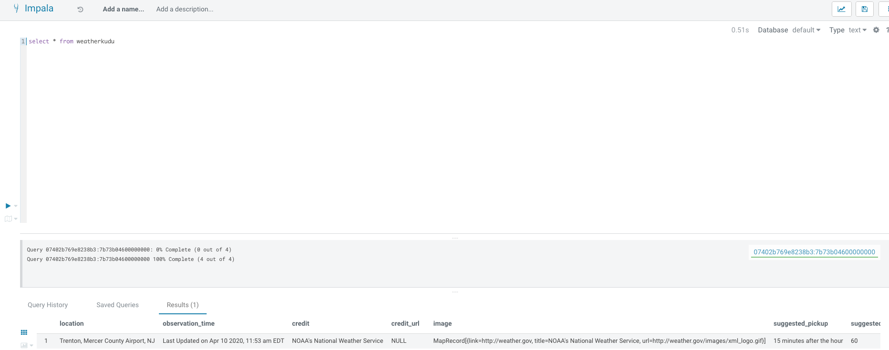
----

The Second fork is to Kafka, this will be for the 'all' path.

image::images/publishKafka.png[width=800]

Kafka Brokers:  edge2ai-1.dim.local:9092
Topic:  weather
Reader & Writer:  reuse the JSON ones

The Third and final fork is to HDFS (could be ontop of S3 or Blob Storage) as Apache ORC files.   This will also autogenerate the DDL for an external Hive table as an attribute, check your provenance after running.

image::images/mergerecord.png[width=800]

JSON in and out for record readers/writers, you can adjust the time and size of your batch or use defaults.

image::images/putorc.png[width=800]

image::images/putorc1.png[width=800]

image::images/putorc2.png[width=800]

Hadoop Config:   /etc/hadoop/conf/hdfs-site.xml,/etc/hadoop/conf/core-site.xml
Record Reader:   Infer Json
Directory:   /tmp/weather
Table Name:   weather

Before we run, build the /tmp/weather directory in HDFS and give it 777 permissions.   We can do this with Apache Hue.

image::images/createhdfsdir.png[width=800]

image::images/changepermissionshdfsdir.png[width=800]

Once we run we can get the table DDL and location:

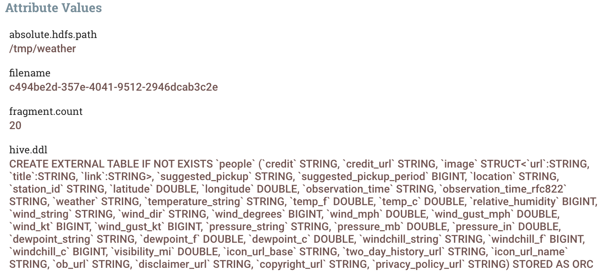

Go to Hue to create your table.

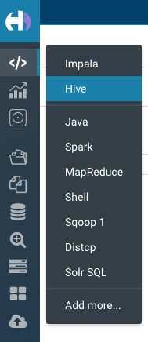

[source,sql]
----
CREATE EXTERNAL TABLE IF NOT EXISTS `weather` 
(`credit` STRING, `credit_url` STRING, `image` STRUCT<`url`:STRING, `title`:STRING, `link`:STRING>, `suggested_pickup` STRING, `suggested_pickup_period` BIGINT,
`location` STRING, `station_id` STRING, `latitude` DOUBLE, `longitude` DOUBLE, `observation_time` STRING, `observation_time_rfc822` STRING, `weather` STRING, `temperature_string` STRING, 
`temp_f` DOUBLE, `temp_c` DOUBLE, `relative_humidity` BIGINT, `wind_string` STRING, `wind_dir` STRING, `wind_degrees` BIGINT, `wind_mph` DOUBLE, `wind_gust_mph` DOUBLE, `wind_kt` BIGINT,
`wind_gust_kt` BIGINT, `pressure_string` STRING, `pressure_mb` DOUBLE, `pressure_in` DOUBLE, `dewpoint_string` STRING, `dewpoint_f` DOUBLE, `dewpoint_c` DOUBLE, `windchill_string` STRING, 
`windchill_f` BIGINT, `windchill_c` BIGINT, `visibility_mi` DOUBLE, `icon_url_base` STRING, `two_day_history_url` STRING, `icon_url_name` STRING, `ob_url` STRING, `disclaimer_url` STRING, 
`copyright_url` STRING, `privacy_policy_url` STRING) 
STORED AS ORC
LOCATION '/tmp/weather'
----

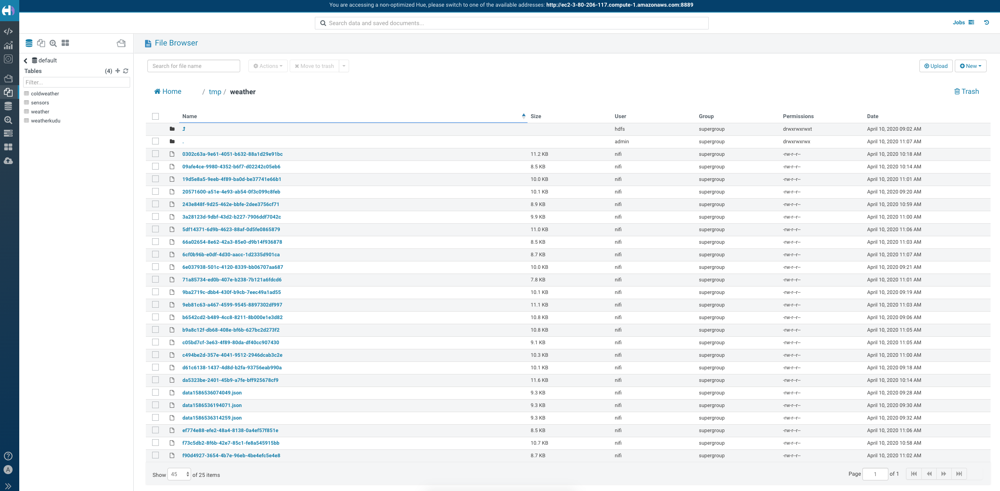

You can now use Apache Hue to query your tables and do some weather analytics.   When we are upserting into Kudu we are ensuring no duplicate reports for a weather station and observation time.

[source,sql]
----
select `location`, weather, temp_f, wind_string, dewpoint_string, latitude, longitude, observation_time
from weatherkudu
order by observation_time desc, station_id asc
----

[source,sql]
----
select *
from weather
----

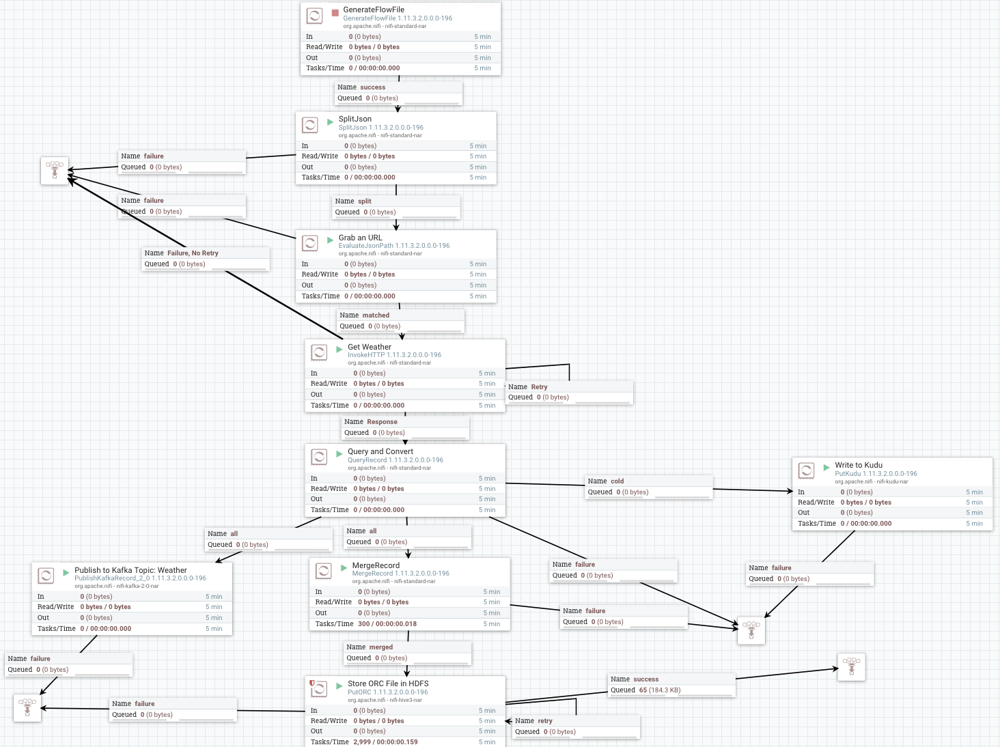

In Atlas, we can see the flow.

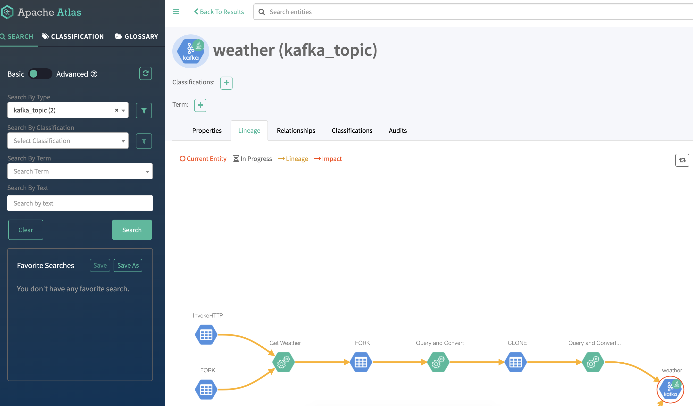
